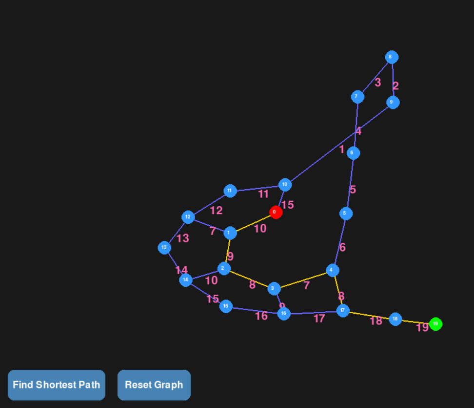
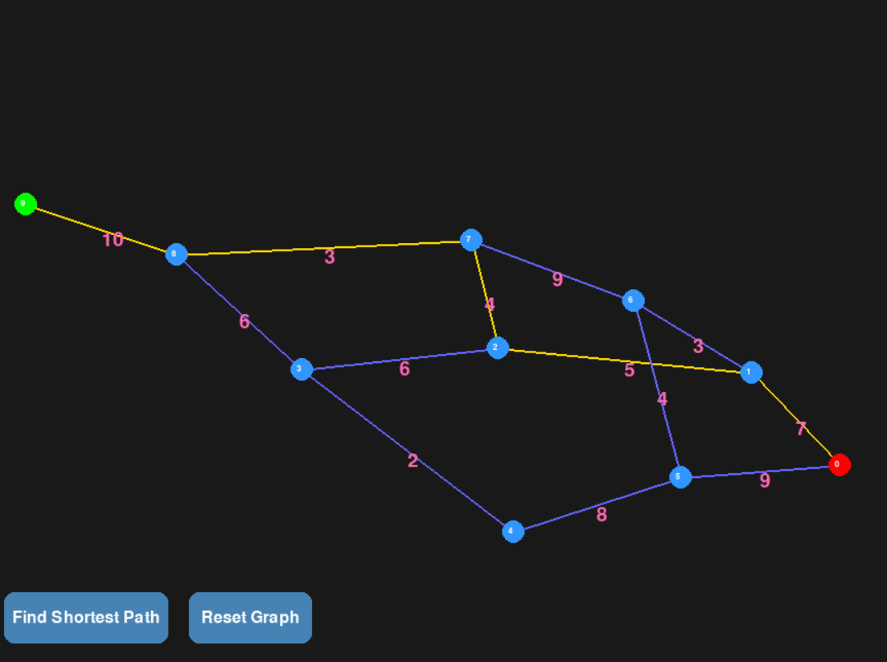
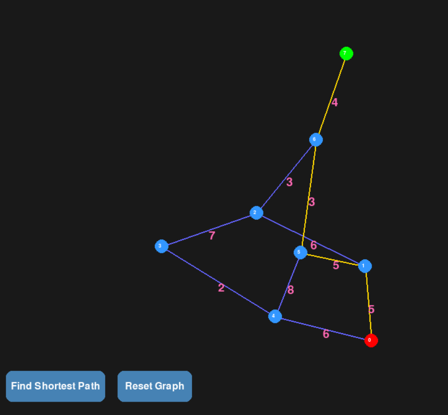

# Shortest Path Finder

## Table of Contents

- [Introduction](#introduction)
- [Features](#features)
- [Technology Used](#technology-used)
- [Setup Guidelines](#setup-guidelines)
- [Screenshots](#screenshots)

## Introduction

The **Shortest Path Finder** is a project designed to calculate the shortest path between nodes in a graph using Dijkstra's Algorithms. This tool is useful for applications such as navigation systems, network optimization, and more.

## Features

- Calculate the shortest path between nodes.
- Visualize the graph and the computed path.
- Support for weighted graphs.
- Interactive user interface for input and output.

## Technology Used

- **Programming Language**: Python
- **Libraries**:
  - `networkx` for graph operations.
  - `matplotlib` for visualization.
  - `tkinter` for GUI (if applicable).
- **Development Tools**: VS Code, Git.

## Setup Guidelines

Follow these steps to set up and run the project:

1. **Clone the Repository**:

   ```bash
   git clone https://github.com/your-username/shortest-path-finder.git
   cd shortest-path-finder
   ```

2. **Install Dependencies**:
   Ensure you have Python installed. Then, install the required libraries:

   ```bash
   pip install networkx matplotlib tkinter
   ```

3. **Run the Application**:
   Execute the main script to start the application:

   ```bash
   python main.py
   ```

## Screenshots

Below are some screenshots of the application in action:

- You can drag, zoom in, and zoom out on the graph visualization for better interaction and analysis.






